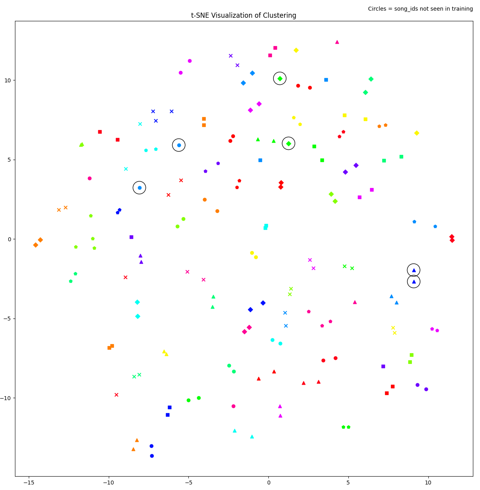
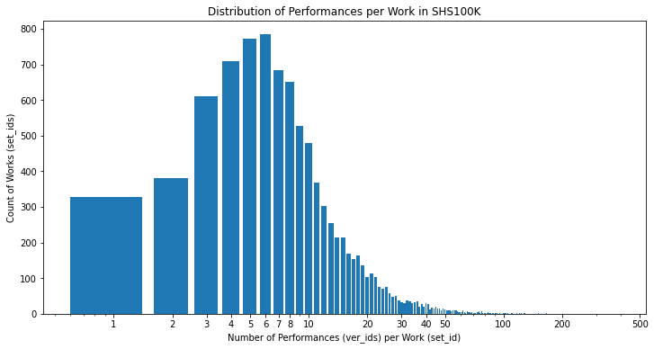

# CoverHunterMPS

Fork of [Liu Feng's CoverHunter](https://github.com/Liu-Feng-deeplearning/CoverHunter) project. Goals: Make it run, and run fast, on any platform. Document it better. And build it out as a useful toolset for music research generally.

See https://ar5iv.labs.arxiv.org/html/2306.09025 for the July 2023 research paper that accompanied the original CoverHunter code. From their abstract: 

> Cover song identification (CSI) focuses on finding the same music with different versions in reference anchors given a query track. In this paper, we propose a novel system named CoverHunter that overcomes the shortcomings of existing detection schemes by exploring richer features with refined attention and alignments. [...] Experiments on several standard CSI datasets show that our method significantly improves over state-of-the-art methods [...].

Our project intends to expand the utility of the CoverHunter model to address a wide range of musicological questions and needs, such as:
- Identify known repertoire items in new, unfamiliar audio (basic CSI)
- Discover and describe how to adapt training hyperparameters for specific musical cultures.
- Make it easy for ethnomusicologists to train this model for specific musical cultures.
- Adapt this model to go beyond CSI to learn and classify audio using other musical categories such as rhythms, styles, tunings, forms, etc.
- Modify, confirm, or debunk established but currently merely subjectively defined musical concepts within specific musical cultures.

# Help Wanted

Collaborators are welcome at any time! That includes:
- Python co-authors
- Neural network designers
- Data scientists
- Data source contributors (music data)
- Musicologists (posing valuable challenges to tackle)
- Anyone interested in learning and practicing in the above fields 

Get started by participating in the Issues or Discussions tabs here in this Github site. Or contact Alan Ng directly (such as by using the Feedback Form link at the bottom of https://www.irishtune.info/public/MLdata.htm).

# Requirements

1. GPU-equipped computer. CPU-only hardware should work but will be very slow. Tested platforms:
    1. Apple computer with an Apple M-series chip
    2. Other computer with an Nvidia GPU (including free cloud options like Google Colab)
2. python3 (minimum version 3.10, tested on 3.11)

# Usage

Either:
- Clone this repo or download it to a folder on your computer. Run the following OS command-line commands from that folder. These commands assume you have a Unix/Linux/MacOS environment, but Windows equivalents exist - [see issue #10](https://github.com/alanngnet/CoverHunterMPS/issues/10).

- Or run this project in Google Colab, using this Colab notebook:
https://colab.research.google.com/drive/1HKVT3_0ioRPy7lrKzikGXXGysxZrHpOr?usp=sharing

## Install Requirements

1. The requirements.txt file contains the python dependencies of the
   project. Run `python -m pip install requirements.txt` to install, or `make
   virtualenv` to install the requirements in a virtualenv (the python3-venv package
   must be installed).

2. Install the `sox` package and its libraries. In some distributions, those
   libraries come in a separate package, like `libsox-fmt-all`.

## Data Preparation

Follow the example of the prepared Covers80 dataset included with the original CoverHunter. Directions here are for using that prepared data. See also the "dataset.txt format" heading below.

1. Download and extract the contents of the `covers80.tgz` file from http://labrosa.ee.columbia.edu/projects/coversongs/covers80/
2. Abandon the 2-level folder structure that came inside the covers80.tgz file, flattening so all the .mp3 files are in the same folder. One way to do this is:
    1. In Terminal, go to the extracted `coversongs` folder as the current directory. Then: 
    2. `cd covers32k && mv */* .; rm -r */`
3. Convert all the provided .mp3 files to .wav format. One way to do this is:
    1. `setopt EXTENDED_GLOB; for f in *.mp3; do sox "$f" -r 16000 "${f%%.mp3}.wav" && rm "$f"; done`
4. Move all these new .wav files to a new folder called `wav_16k` in the project's `data/covers80` folder.
5. You can delete the rest of the downloaded `covers80.tgz` contents.

## Feature Extraction

You must run this before proceeding to the Train step. And you can't run this without first doing the Data Preparation step above.

From the project root folder, run:

`python3 -m tools.extract_csi_features data/covers80/`

See "Input and Output Files" below for more information about what happens here.

## Training

CoverHunter includes a prepared configuration to run a training session on the Covers80 dataset located in the 'training/covers80' subfolder of the project. *Important note:* the default configuration that the CoverHunter authors provided was a nonsense or toy configuration that only demonstrated that you have a working project and environment. It used the same dataset for both training and validation, so by definition it rapidly converged and overfit.

This fork added a train/validate/test data-splitting function in the extract_csi_features tool, along with corresponding new data-preparation hyperparameters.

Specify the path where the training hyperparameters are available (in this case using the provided example for covers80) and where the model output will go, as the one required command-line parameter:

`python -m tools.train training/covers80/`

This fork also added an optional `--runid` parameter so you can distinguish your training runs in TensorBoard in case you are experimenting:

`python -m tools.train training/covers80/ --runid 'first try'`

To see the TensorBoard live visualization of the model's progress during training, run this in a separate terminal window, from the root of the project folder, and then use the URL listed in the output to watch the TensorBoard:

`tensorboard --logdir=training/covers80/logs`

Optionally edit the `hparams.yaml` configuration file in the folder `training/covers80/config` before starting a training run. If you run into memory limits, start with decreasing the batch size from 64 to 32.

This fork added the hyperparameter `early_stopping_patience` to support the added feature of early stopping (original CoverHunter defaulted to 10,000 epochs!).

Note: Don't use the `torchrun` launch command offered in original CoverHunter. In the single-computer Apple Silicon context, it is not only irrelevant, it actually slows down performance. In my tests it slowed down tools.train performance by about 20%.

The training script's output consists of checkpoint files and embedding vectors, described below in the "Training checkpoint output" section.

## Hyperparameter Tuning

After you use the tools.train script to confirm your data is usable with CoverHunterMPS, and perhaps to do some basic experimentation, you may be interested in trying a wide range of training hyperparameters to discover the optimal settings for your data. You should be able to use your knowledge of its unique musical characteristics to make some educated guesses on how to diverge from the default CoverHunter hyperparameters, which are optimized for Western pop music. 

Step 1: Study the explanations of the training hyperparameters below to make some hypotheses about alternative hyperparameter values to try with your data. 

Step 2: Add your hypotheses as specific hyperparameter values to try in the hp_tuning.yaml file in the model's training folder, following the comments and examples there. 

Step 3: Launch training with `model_dir` as the one required parameter:

`python -m tools.train_tune training/covers80`

This script will not retain any model checkpoints from the training runs, but it does create separate log files for each run that you can monitor and study in TensorBoard.

## Production Training

Once you have tuned your data and your hyperparameters for optimal training results, you may be ready to train a model that knows *all* of your data, without reserving any data for validation and test sets. The tools/train_prod.py script uses stratified K-fold cross validation to dynamically generate validation sets from your dataset so that the model is exposed to all works and perfs equally. It concludes with one final training run on the entire dataset in which the dataset you specify in `test_path` serves as the validation dataset (for early stopping purposes). This final validation set should be entirely unseen perfs, even if some or all of the works are represented in the training data.

Use the full.txt output from extract_csi_features.py for your `train_path` with `val_data_split`, `val_unseen`, `test_data_split`, and `test_data_unseen` all set to 0. Prepare the training/covers80/hparams_prod.yaml file following the instructions in the comment header of train_prod.py. An example hparams_prod.yaml is provided for using covers80 for testing purposes. Launch training with:

`python -m tools.train_prod training/covers80/ --runid='test of production training'`

TensorBoard will show each fold as a separate run, but within a continuous progression of epochs.

## Evaluation

This script evaluates your trained model by providing mAP and MR1 metrics and an optional t-SNE clustering plot (compare Fig. 3 in the CoverHunter paper).

1. Have a pre-trained CoverHunter model's output checkpoint files available. You only need your best set (typically your highest-numbered one). If you use original CoverHunter's pre-trained model from https://drive.google.com/file/d/1rDZ9CDInpxQUvXRLv87mr-hfDfnV7Y-j/view), unzip it, and move it to a folder that you specify in step 3 below.
2. Run your query data through `extract_csi_features.py`. In the `hparams.yaml` file for the feature extraction, turn off all augmentation. See `data/covers80_testset/hparams.yaml` for an example configuration to treat covers80 as the query data:  `python3 -m tools.extract_csi_features data/covers80_testset` 
The important output from that is `full.txt` and the `cqt_feat` subfolder's contents.
3. Run the evaluation script. This example assumes you are using the trained model you created in `training/covers80` and you want to use all the optional features I added in this fork: 
`python3 -m tools.eval_testset training/covers80 data/covers80_testset/full.txt data/covers80_testset/full.txt -plot_name="training/covers80/tSNE.png" -dist_name='distmatrix' -test_only_labels='data/covers80/test-only-work-ids.txt'`

See the "Training checkpoint output" section below for a description of the embeddings saved by the `eval_for_map_with_feat()` function called in this script. They are saved in a new subfolder of the `pretrained_model` folder named `embed_NN_tmp` where NN is the highest-numbered epoch subfolder in the `pretrained_model` folder.

### Arguments

#### query_in_ref_path
CoverHunter only shared an evaluation example for the case when query and reference data are identical, presumably to do a self-similarity evaluation of the model. But there is an optional 4th parameter for `query_in_ref_path` that would be relevant if query and reference are not identical. See the "query_in_ref" heading below under "Input and Output Files."

#### plot_name
The optional `plot_name` argument is a path or just a filename where you want to save the t-SNE plot output. If you provide just a filename, `model_dir` will be used as the path. See example plot below. Note that your query and reference files must be identical to generate a t-SNE plot (to do a self-similarity evaluation).

#### test_only_labels
The optional `test_only_labels` argument is a path to the text file generated by `extract_csi_features.py` if its hyperparameters asked for some work_ids to be reserved exclusively for the test dataset. The t-SNE plot will then mark those for you to see how well your model can cluster classes (work_ids) it has never seen before.

This figure shows the results of training from scratch on the covers80 dataset with a train/val/test split of 8:1:1 and 3 classes (work_ids) reserved exclusively for the test dataset.

#### dist_name
The optional `dist_name` argument is a path where you want to save the distance matrix and ref labels so that you can study the results separately, such as perhaps doing custom t-SNE plots, etc.

#### marks
The default value for the optional `marks` argument is 'markers', which makes the output for `plot_name` differentiate works by using using standard matplotlib markers in various colors and shapes. The alternative value is 'ids' which uses the `work_id` numbers defined by extract_csi_features instead of matplotlib markers.   
 
## Inference (work identification)

After you have trained a model and run the evaluation script, you can use the model to identify any music you give it. Provide the music input to the tools.identify.py script by creating a one-line text file that has the metadata about the music, following the format of the text files generated by tools.extract_csi_features.py. For example, you could select any of the entries in the data/covers80/full.txt file, like a speed-augmented version of one of the 80 works
 
Example for covers80:
`python -m tools.identify training/covers80 target.txt -top=10`

To interpret the output, use the data/covers80/work_id.map text file to see which `work_id` goes with which `work`. Good news: even the bare-bones demo of training from scratch on covers80 shows that CoverHunter does a very good job of identifying versions (covers) of those 80 pop songs.

## Coarse-to-Fine Alignment Training

CoverHunter did not include an implementation of the coarse-to-fine alignment training described in the research paper. (Liu Feng confirmed to me that his employer considers it proprietary technology). [See issue #1](https://github.com/alanngnet/CoverHunterMPS/issues/1). But it did include this script which apparently could be useful as part of an implementation we could build ourselves. The command to launch the alignment script that CoverHunter included is:

`python3 -m tools.alignment_for_frame pretrained_model data/covers80/full.txt data/covers80/alignment.txt`

Arguments to pass to the script:
1. Folder containing a pretrained model. For example if you use original CoverHunter's model from https://drive.google.com/file/d/1rDZ9CDInpxQUvXRLv87mr-hfDfnV7Y-j/view), unzip it, and move it to a folder that you rename to `pretrained_model` at the top level of your project folder. That folder in turn must contain a `pt_model` subfolder that contains the do_000[epoch] and g_000[epoch] checkpoint files.
2. The output from tools/extract_csi_features.py or an equivalent script. The metadata file like full.txt  must include `work_id` values for each `perf` (unlike the raw `dataset.txt` file that CoverHunter provided for covers80).
3. The `alignment.txt` file will receive the output of this script.

# Input and Output Files

## Hyperparameters (hparams.yaml)

There are two different hparams.yaml files, each used at different stages. 

### Data Preparation Hyperparameters

The hparams.yaml file located in the folder you provide on the command line to tools.extract_csi_features.py is used only by that script.

| key | value |
| --- | --- |
| add_noise| Original CoverHunter provided the example of: 
{  &nbsp; `prob`: 0.75,  &nbsp; `sr`: 16000,  &nbsp; `chunk`: 3,  &nbsp; `name`: "cqt_with_asr_noise",  &nbsp; `noise_path`: "dataset/asr_as_noise/dataset.txt" } However, the CoverHunter repo did not include whatever might supposed to be in "dataset/asr_as_noise/dataset.txt" file nor does the CoverHunter research paper describe it. If that path does not exist in your project folder structure, then tools.extract_csi_features will just skip the stage of adding noise augmentation. At least for training successfully on Covers80, noise augmentation doesn't seem to be needed.|
| aug_speed_mode | list of ratios used in tools.extract_csi_features for speed augmention of your raw training data. Example: [0.8, 0.9, 1.0, 1.1, 1.2] means use 80%, 90%, 100%, 110%, and 120% speed variants of your original audio data.|
| bins_per_octave | See `fmin` and `n_bins`. If your musical culture uses a scale that does not fit in the Western standard 12-semitone scale, set this to a higher number. Default 12. |
| device | 'mps' or 'cuda', corresponding to your GPU hardware and PyTorch library support. 'cpu' is not currently implemented but could be if needed. Original CoverHunter used CPU for this stage but was much slower. |
| fmin | The lowest frequency you want the CQT arrays to include. Set this to just below the lowest pitch used in the musical culture you are teaching the model. Consider only the pitches relevant to the work-identification skill you want it to learn. For example, in some cultures, bass accompaniment is not relevant for work identification. Default is 32. |
| n_bins | The number of frequency bins you want the CQT arrays to include. For example, if you set `bins_per_octave` to 12, then set `n_bins` to 12 times the number of octaves above `fmin` that are relevant to this culture's work-identification skill. Be sure to also set the `input_dim` training hyperparameter to match this number. Default is 96. |
| val_data_split | percent of training data to reserve for validation expressed as a fraction of 1. Example for 10%: 0.1 |
| val_unseen | percent of work_ids from training data to reserve exclusively for validation expressed as a fraction of 1. Example for 2%: 0.02 |
| test_data_split | percent of training data to reserve for test expressed as a fraction of 1. Example for 10%: 0.1 |
| test_data_unseen | percent of work_ids from training data to reserve exclusively for test expressed as a fraction of 1. Example for 2%: 0.02  |

### Training Hyperparameters
The hparams.yaml file located in the "config" subfolder of the path you provide on the command line to tools.train.py uses all the other parameters listed below during training.

#### Data Sources

| key | value |
| --- | --- |
| covers80:  &nbsp; query_path  &nbsp; ref_path  &nbsp; every_n_epoch_to_test | Test dataset(s) used for automated model evaluation purposes during training. "covers80" was the only example provided with the original CoverHunter. For an example of a different culture's test set, see https://www.irishtune.info/public/MLdata.htm. Note that ref_path and query_path are set to the same data in order to do a self-similarity evaluation, testing how well the model can cluster samples (perfs) relative to their known classes (works). You can add as many test datasets as you want. Each will be displayed as separate results in the TensorBoard visualization during training.  Subparameters for covers80: `query_path`: "data/covers80/full.txt" `ref_path`: "data/covers80/full.txt" `every_n_epoch_to_test`: How many epochs to wait between each test of the current model against this testset. |
| test_path | Compare `train_path` and `val_path`. This dataset is used in each epoch to run the same validation calculation as with the `val_path`. Presumably one should include both classes and samples that were excluded from both `train_path` and `val_path`. |
| train_path | path to a JSON file containing metadata about the data to be used for model training (See full.txt below for details) |
| val_path | Path to a JSON file containing metadata about the data to be used for model validation. Compare `test_path` above. Presumably one should include a balanced distribution of samples that are *not* included in the `train_path` dataset, but do include samples for the classes represented in the `train_path` dataset. (See full.txt below for details) |

#### Dataset Parameters
| key | value |
| --- | --- |
| chunk_frame | List of 3 numbers used with `mean_size` that describe the duration of each chunk, measured as a count of CQT features. CoverHunter's covers80 config used [1125, 900, 675]. Here the word "chunk" apparently refers to the chunks described in the time-domain pooling strategy part of the CoverHunter paper, not the chunks discussed in their coarse-to-fine alignment strategy. See also `chunk_s`. In our experiments, the 5:4:3 ratio that CoverHunter used is significantly better than a variety of alternative ratios we tried. However, in Irish traditional music, which has shorter time structures than Western pop music, we achieved better results using shorter durations than [1125, 900, 675]. | 
| chunk_s | Duration of the first-listed (longest) `chunk_frame` in seconds. You have to manually calculate `chunk_s` = `chunk_frame[0]` / audio sample rate * `mean_size`. Couldn't the script just calculate this itself using CQT hop-size to get the sample rate? |
| cqt: hop_size: | Fine-grained time resolution, measured as duration in seconds of each CQT spectrogram slice of the audio data (the inverse of the audio sample rate). CoverHunter's provided setting is 0.04 with a comment "1s has 25 frames", but this meaning of "frame" is not the same meaning of "frame" as used more appropriately in `chunk_frame`. Presumably the intended meaning here would conventionally be described as: "audio sample rate of 25 samples per second." The value 25 is hard-coded as an assumption into CoverHunter in various places. |
| data_type | "cqt" (default) or "raw" or "mel". It remains unknown whether the CoverHunter team actually implemented or tested anything but CQT-based training. |
| mean_size | See `chunk_s` above. An integer used in combination with `chunk_frame` to define the length of the chunks. |
| mode | "random" (default) or "defined". Changes behavior of AudioFeatDataset related to how it cuts each audio sample into chunks. "random" is described in CoverHunter code as "cut chunk from feat from random start". "defined" is described as "cut feat with 'start/chunk_len' info from line." We observed better training results using "defined" when working with datasets that are very consistently trimmed so that CSI-relevant audio always starts right at the beginning of the recording. "random" would be better when CSI-irrelevant audio may be present at the start of many of your audio data samples. |
| m_per_class | From CoverHunter code comments: "m_per_class must divide batch_size without any remainder" and: "At every iteration, this will return m samples per class. For example, if dataloader's batch-size is 100, and m = 5, then 20 classes with 5 samples iter will be returned." |
| spec_augmentation | spectral(?) augmentation settings, used to generate temporary data augmentation on the fly during training.  CoverHunter settings were: `random_erase`:  &nbsp; `prob`: 0.5  &nbsp; `erase_num`: 4 `roll_pitch`:  &nbsp; `prob`: 0.5  &nbsp; `shift_num`: 12 |
| spec_augmentation : random_erase | During each epoch, each CQT array may have a rectangular block of its array values replaced with the value -80 (a low amplitude signal). The size of the block is defined as 25% of the height of the frequency bins and 10% of the width of the time bins. `prob` specifies the probability of calling the erase method for this feature in this epoch, between 0 and 1. `erase_num` specifies the quantity of such blocks that will be erased if the erase method is called. |
| spec_augmentation : roll_pitch | During each epoch, each CQT array may be shifted pitch-wise. CoverHunter's original method, left as the default here, was to rotate the entire array in the frequency dimension, with the overflowing content wrapped around to the opposite end of the spectrum. For example, if shifted an octave up, then the top octave's CQT content would be presented as the bottom octave of content. `prob` specifies the probability of doing this for this feature in this epoch, between 0 and 1. `shift_num` specifies the number of frequency CQT bins by which the array will be shifted. `low_melody` is an optional hyperparameter and feature added for CoverHunterMPS to accommodate musical cultures in which CSI-significant melodic content may appear in the bottom frequency range of the CQT array. Since trimming CQT arrays to eliminate irrelevant harmonic and percussive content in the bottom octaves has proven beneficial, this feature can be significantly useful. In this case, instead of rotating the entire array either up or down, the array is shifted upwards either 1 x or 2 x `shift_num` bins, and overflowing high-frequency content is simply discarded, instead of being copied to the bottom rows of the array. |

#### Training Parameters
| key | value |
| --- | --- |
| batch_size | Usual "batch size" meaning in the field of machine learning. An important parameter to experiment with. Original CoverHunter's preset batch size of 16 was no longer able to succeed at the covers80 training task after @alanngnet fixed an important logic error in extract_csi_features.py. Now only batch size 32 or larger works for covers80. |
| device | 'mps' or 'cuda', corresponding to your GPU hardware and PyTorch library support. Theoretically 'cpu' could work but untested and probably of no value. |
| early_stopping_patience | how many epochs to wait for validation loss to improve before early stopping |
| learning_rate | The initial value for how much variability to allow the model during each learning step. See `lr_decay`. Default = .001. |
| lr_decay | Learning-rate decay - see `learning_rate`. Default = .9975, but for small data sets, such as during testing and tuning work, we found lower values like .99 more appropriate. |
| min_lr | Minimum learning rate, below which `lr_decay` is ignored. Default = 0.0001. |

#### Model Parameters
| key | value |
| --- | --- |
| embed_dim | 128 |
| encoder | # model-encode Subparameters: `attention_dim`: 256 # "the hidden units number of position-wise feed-forward" `output_dims`: 128 `num_blocks`: 6 # number of decoder blocks |
| input_dim | The "vertical" (frequency) dimension size of the CQT arrays you provide to the model. Set this to the same value you used for `n_bins` in the data preparation hyperparameters. Default is 96. |

## dataset.txt

A JSON formatted or tab-delimited key:value text file (see format defined in the utils.py::line_to_dict() function) expected by extract_csi_features.py that describes the training audio data, with one line per audio file.
| key | value |
| --- | --- |
| perf | Unique identifier. Abbreviation for "performance." CoverHunter originally used "utt" throughout, borrowing the term "utterance" from speech-recognition ML work which is where much of their code was adapted from. Example "cover80_00000000_0_0". |
| wav | relative path to the raw audio file. Example: "data/covers80/wav_16k/annie_lennox+Medusa+03-A_Whiter_Shade_Of_Pale.wav" |
| dur_s | duration of the audio file in seconds. Example 316.728 |
| work | title of the work. Example "A_Whiter_Shade_Of_Pale" The `_add_work_id()` function in extract_csi_features assumes that this string is a unique identifier for the work (so it can't handle musically distinct works that happen to have the same title). Advice: Use a unique, stable identifier that applies across the entire musical culture in which you will be training. For example in Irish traditional music, use the irishtune.info TuneID number. |
| version | Not used by CoverHunter. Example from covers80: "annie_lennox+Medusa+03-A_Whiter_Shade_Of_Pale.mp3", which would have been the original audio file source for that perf. |

## full.txt 

full.txt is the JSON-formatted training data catalog for tools.train.py, generated by tools.extract_csi_features. In case you do your own data prep instead of using tools.extract_csi_features, here's the structure of full.txt.

| key | value |
| --- | --- |
| perf | See dataset.txt. Except in this context, for each original perf, extract_csi_features generates additional artificial variants, which each get their own perf identifier. |
| wav | (see dataset.txt) |
| dur_s |(see dataset.txt) |
| work | (see dataset.txt) |
| version | (see dataset.txt) |
| feat | path to the CQT features of this perf stored as .npy array. Example: "data/covers80/cqt_feat/sp_0.8-cover80_00000146_71_0.cqt.npy" |
| feat_len | output of len(np.load(feat)). Example: 9198 |
| work_id | internal, arbitrary unique identifier for the work. This is what teaches the model which perfs (performances) are considered by humans to be the "same work." Example: 0 |
| version_id | internal, arbitrary unique identifier for each artificially augmented variant of the original perf (performance). Example: 0 |

## work_id.map 

Text file crosswalk between "work" (unique identifying string per work) and the "work_id" number arbitrarily assigned to each "work" by the extract_csi_features.py script. Not used by any scripts in this project currently, but definitely useful as a reference for human interpretation of training results.

## Other Files Generated by extract_csi_features.py

| filename | comments |
|---|---|
| cqt_feat subfolder | Contains the Numpy array files of the CQT data for each file listed in full.txt. Needed by train.py. Also used each time you run extract_csi_features.py to save time in creating CQT data by skipping CQT generation for samples already represented in this folder. |
| data.init.txt | Copy of dataset.txt after sorting by `perf` and de-duping. Not used by train.py |
| test.txt | A subset of full.txt generated by the `_split_data_by_work_id()` function intended for use by train.py as the `test` dataset. |
| test-only-work-ids.txt | Text file listing one work_id per line for each work_id that the train/val/test splitting function held out from train/val to be used exclusively in the test dataset. This file can be used by `eval_testset.py` to mark those samples in the t-SNE plot. |
| full.txt | See above detailed description. Contains the entire dataset you provided in the input file. | 
| work_id.map | Text file, with 2 columns per line, separated by a space, sorted alphabetically by the first column. First column is a distinct "work" string taken from dataset.txt. Second column is the `work_id` value assigned to that "work." |
| sp_aug subfolder | Contains the sox-modified wav speed variants of the raw training .wav files, at the speeds defined in hparams.yaml. Not used by train.py. Also used each time you run extract_csi_features.py to save time in creating speed variants by skipping speed augmentation for samples already represented in this folder. |
| sp_aug.txt | Copy of data.init.txt but with addition of 1 new row for each augmented variant created in sp_aug/*.wav. Not used by train.py. |
| train.txt | A subset of full.txt generated by the `_split_data_by_work_id()` function intended for use by train.py as the `train` dataset. |
| val.txt | A subset of full.txt generated by the `_split_data_by_work_id()` function intended for use by train.py as the `val` dataset. |

Original CoverHunter also generated the following files, but were not used by their published codebase, so I commented out those functions:

| filename | comments |
|---|---|
| work_id_num.map | Text file, not used by train.py, maybe not by anything else? |
| work_name_num.map | Text file, not used by train.py, maybe not by anything else? |

## Training Checkpoint Output

Using the default configuration, training saves checkpoints after each epoch in the training/covers80 folder.

The `pt_model` subfolder gets two files per epoch: do_000000NN and g_000000NN where NN=epoch number. The do_ files contain the AdamW optimizer state. The g_ files contain the model's state dictionary. "g" might be an abbreviation for "generator" given that a transformer architecture is involved?

The `eval_for_map_with_feat()` function, called at the end of each epoch, also saves data in a separate new subfolder for each epoch, named epoch_NN_covers80. This in turn gets a `query_embed` subfolder containing the model-generated embeddings for every sample in the training data, plus the embeddings for time-chunked sections of those samples, named with a suffix of ...__start-N.npy where N is the timecode in seconds of where the chunk starts. The saved embeddings are 1-dimensional arrays containing 128 double-precision (float64) values between -1 and 1. The epoch_NN_covers80 folder also gets an accompanying file `query.txt` (with an identical copy as `ref.txt`) which is a text file listing the attributes of every training sample represented in the `query_embed` subfolder, following the same format as described above for `full.txt`.

## query_in_ref

The file you can prepare for the `tools/eval_testset.py` script to pass as the 4th parameter `query_in_ref_path` (CoverHunter did not provide an example file or documentation) assumes:
- JSON or tab-delimited key:value format
- The only line contains a single key "query_in_ref" with a value that is itself a list of tuples, where each tuple represents a mapping between an index in the query input file and an index in the reference input file.
This mapping is only used by the `_generate_dist_matrix()` function. That function explains: "List[(idx, idy), ...], means query[idx] is in ref[idy] so we skip that when computing mAP." idx and idy are the sequentially assigned index numbers to each perf in the order they appear in the query and ref data sources.

# Code Map

Hand-made visualization of how core functions of this project interact with each other. Also includes additional beginner-friendly or verbose code-commenting that I didn't add to the project code. Not regularly maintained, but still useful for getting oriented in this project's code:

https://miro.com/app/board/uXjVNkDkn70=/ 

# Unit Tests

Unit tests are in progress, currently only with partial code coverage. Run them from
the repository root using:

`python3 -m unittest -c tests/test_*.py`

or if you installed the project in a virtualenv:

`make tests` 

# Distribution of Works vs. Performances 

As a contribution to the CSI community, where the [SHS100K dataset](https://github.com/NovaFrost/SHS100K) has been used as a standard training dataset for many years, including for the CoverHunter research paper, here is a histogram showing the distribution of works vs. performances in SHS100K.

This figure may be helpful as a reference for comparing the distribution of works vs. performances in datasets you want to use with CoverHunterMPS, knowing that CoverHunter was able to train successfully given this distribution. 

To help you understand this visualization of the SHS100K dataset, here are some example data points from it: The most common work ("Summertime") is represented by  387 performances, and there are over 300 works having only a single performance. The most common count of performances per work is 6.